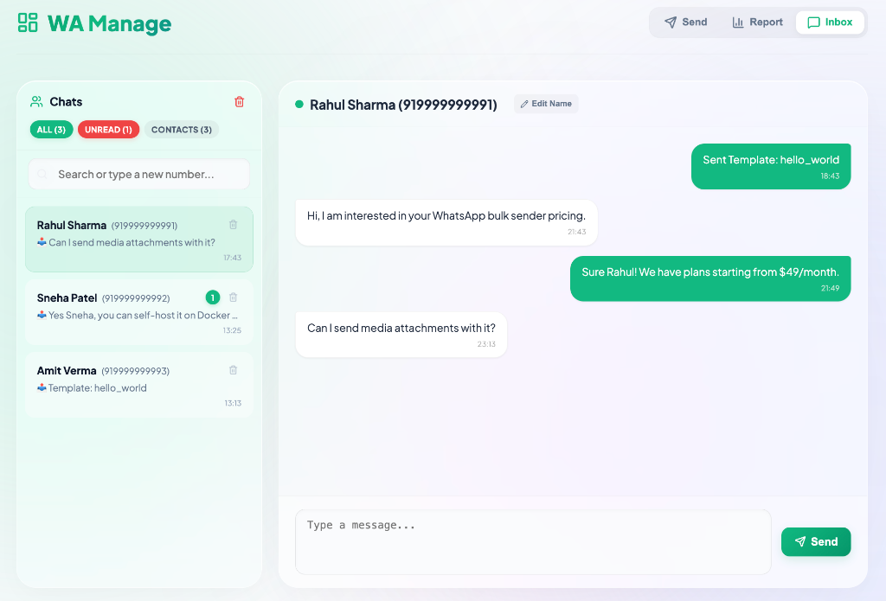
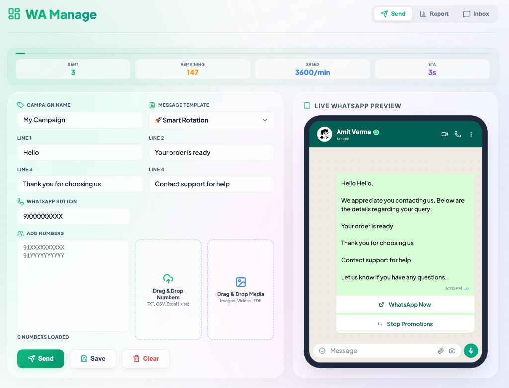
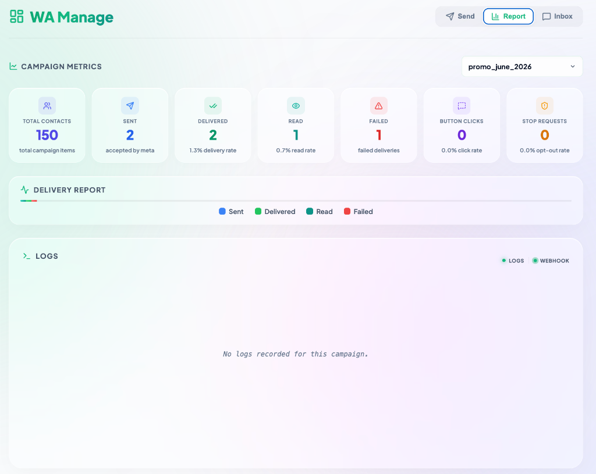

# 📱 WhatsApp Management Dashboard

### Self-hosted Go/JS WhatsApp campaign broadcaster and real-time chat inbox using Meta Cloud API.

[](https://go.dev/)
[](LICENSE)

---

## ✨ Features
* **💬 Two-Way Inbox:** Real-time chat sync using SSE (Server-Sent Events) with delivery indicators (✔️ sent, ✔️✔️ read).
* **📢 Bulk Campaigns:** High-concurrency broadcast pool using **40 parallel Go workers**.
* **📂 Smart Import:** Drag & drop numbers from TXT, CSV, or Excel (.xlsx).
* **🔄 Auto Fallback:** Dynamically rotates and retries template sends up to 3 times on failures.
* **🏷️ Alias Directory:** Inline renaming of contacts saved in SQLite database.
* **🎨 Glassmorphic UI:** Modern responsive dark/light style UI.

---

## 📸 Interface Screenshots

<div align="center">
  <h4>📨 Two-Way Chat Inbox</h4>
  
  
  <h4>📢 Bulk Campaign Broadcaster</h4>
  

  <h4>📊 Real-Time Campaign Analytics</h4>
  
</div>

---

## ⚡ Quick Start

```bash
# 1. Clone & Copy config
cp .env.example .env

# 2. Add credentials in .env
PORT=9090
WHATSAPP_TOKEN=your_token
PHONE_NUMBER_ID=your_id
WABA_ID=your_waba_id
VERIFY_TOKEN=your_token
WEBHOOK_URL=https://your-public-url.com/webhook

# 3. Download dependencies & start
go mod tidy
go run src/webhook.go src/campaign.go src/db.go src/templates.go
```
Open **[http://localhost:9090](http://localhost:9090)** in your browser.

---

## 📡 Webhook Setup
1. Expose port `9090` publicly (e.g. via Cloudflare Tunnels).
2. Set Webhook Callback URL in Meta Developer Console to `{WEBHOOK_URL}/webhook`.
3. Set Verify Token and subscribe to `messages` & `messages_deliveries` events.

---

## 🗄️ SQLite Schema (`data/tracker.db`)
* `sends`: Outbound campaign delivery statuses.
* `replies`: Two-way chat messages.
* `contacts`: Name directory list.
* `campaigns`: Cached analytics data.

---

## 📄 License
MIT License.
